+++
date = '2026-02-14T23:48:19-06:00'
draft = false
title = 'Practica1: Elementos básicos de los lenguajes de programación'
+++

-----Cola con memoria estática-----

#include <stdio.h>
#include <string.h>

#define MAX_USER 32
#define MAX_DOC 48
#define MAX_JOBS 10

typedef enum { NORMAL=0, URGENTE=1 } Prioridad_t;

typedef enum {
    EN_COLA=0,
    IMPRIMIENDO=1,
    COMPLETADO=2,
    CANCELADO=3
} Estado_t;

typedef struct {
    int id;
    char usuario[MAX_USER];
    char documento[MAX_DOC];
    int paginas_total;
    int paginas_restantes;
    int copias;
    Prioridad_t prioridad;
    Estado_t estado;
    int ms_por_pagina;
} PrintJob_t;

typedef struct {
    PrintJob_t data[MAX_JOBS];
    int size;
} QueueStatic_t;

/* Prototipos */
void qs_init(QueueStatic_t* q);
int  qs_is_empty(const QueueStatic_t* q);
int  qs_is_full(const QueueStatic_t* q);
int  qs_enqueue(QueueStatic_t* q, PrintJob_t job);
int  qs_peek(const QueueStatic_t* q, PrintJob_t* out);
int  qs_dequeue(QueueStatic_t* q, PrintJob_t* out);
void qs_print(const QueueStatic_t* q);

int main()
{
    QueueStatic_t q;
    qs_init(&q);

    int opcion;
    int next_id = 1;

    do
    {
        printf("\n1) Agregar\n");
        printf("2) Listar\n");
        printf("3) Peek\n");
        printf("4) Dequeue\n");
        printf("0) Salir\n");
        printf("Opcion: ");

        scanf("%d", &opcion);
        getchar();

        switch(opcion)
        {
            case 1:
            {
                PrintJob_t job;

                job.id = next_id;
                next_id++;

                printf("Usuario: ");
                fgets(job.usuario, MAX_USER, stdin);

                for(int i = 0; job.usuario[i] != '\0'; i++)
                {
                    if(job.usuario[i] == '\n')
                    {
                        job.usuario[i] = '\0';
                        break;
                    }
                }

                if(job.usuario[0] == '\0')
                {
                    printf("Usuario invalido.\n");
                    next_id--;
                    break;
                }

                printf("Documento: ");
                fgets(job.documento, MAX_DOC, stdin);

                for(int i = 0; job.documento[i] != '\0'; i++)
                {
                    if(job.documento[i] == '\n')
                    {
                        job.documento[i] = '\0';
                        break;
                    }
                }

                printf("Paginas total: ");
                scanf("%d", &job.paginas_total);
                getchar();

                if(job.paginas_total <= 0)
                {
                    printf("Paginas invalidas.\n");
                    next_id--;
                    break;
                }

                job.paginas_restantes = job.paginas_total;
                job.copias = 1;
                job.prioridad = NORMAL;
                job.estado = EN_COLA;
                job.ms_por_pagina = 300;

                if(qs_enqueue(&q, job))
                {
                    printf("Agregado id=%d\n", job.id);
                }
                else
                {
                    printf("Cola llena.\n");
                }

                break;
            }

            case 2:
            {
                qs_print(&q);
                break;
            }

            case 3:
            {
                PrintJob_t job;

                if(qs_peek(&q, &job))
                {
                    printf("Siguiente -> id=%d usuario=%s documento=%s",job.id,job.usuario,job.documento);
                }
                else
                {
                    printf("Cola vacia.\n");
                }

                break;
            }

            case 4:
            {
                PrintJob_t job;

                if(qs_dequeue(&q, &job))
                {
                    printf("Quitado id=%d usuario=%s documento=%s",job.id,job.usuario,job.documento);
                }
                else
                {
                    printf("Cola vacia.\n");
                }

                break;
            }

            case 0:
            {
                printf("Saliendo del programa\n");
                break;
            }

            default:
            {
                printf("Opcion invalida.\n");
                break;
            }
        }

    } while(opcion != 0);

    return 0;
}

void qs_init(QueueStatic_t* q)
{
    q->size = 0;
}

int qs_is_empty(const QueueStatic_t* q)
{
    if(q->size == 0)
    {
        return 1;
    }
    else
    {
        return 0;
    }
}

int qs_is_full(const QueueStatic_t* q)
{
    if(q->size == MAX_JOBS)
    {
        return 1;
    }
    else
    {
        return 0;
    }
}

int qs_enqueue(QueueStatic_t* q, PrintJob_t job)
{
    if(qs_is_full(q))
    {
        return 0;
    }

    q->data[q->size] = job;
    q->size++;

    return 1;
}

int qs_peek(const QueueStatic_t* q, PrintJob_t* out)
{
    if(qs_is_empty(q))
    {
        return 0;
    }

    *out = q->data[0];
    return 1;
}

int qs_dequeue(QueueStatic_t* q, PrintJob_t* out)
{
    if(qs_is_empty(q))
    {
        return 0;
    }

    *out = q->data[0];

    for(int i = 1; i < q->size; i++)
    {
        q->data[i - 1] = q->data[i];
    }

    q->size--;

    return 1;
}

void qs_print(const QueueStatic_t* q)
{
    if(qs_is_empty(q))
    {
        printf("Cola vacia.\n");
        return;
    }

    for(int i = 0; i < q->size; i++)
    {
        printf("id=%d usuario=%s documento=%s",q->data[i].id,q->data[i].usuario,q->data[i].documento);
    }
}

-----Cola con memoria dinámica-----

#include <stdio.h>
#include <string.h>
#include <stdlib.h>

#define MAX_USER 32
#define MAX_DOC 48

typedef enum { NORMAL=0, URGENTE=1 } Prioridad_t;

typedef enum {
    EN_COLA=0,
    IMPRIMIENDO=1,
    COMPLETADO=2,
    CANCELADO=3
} Estado_t;

typedef struct {
    int id;
    char usuario[MAX_USER];
    char documento[MAX_DOC];
    int paginas_total;
    int paginas_restantes;
    int copias;
    Prioridad_t prioridad;
    Estado_t estado;
    int ms_por_pagina;
} PrintJob_t;

typedef struct Node_t {
    PrintJob_t job;
    struct Node_t* next;
} Node_t;

typedef struct {
    Node_t* head;
    Node_t* tail;
    int size;
} QueueDynamic_t;

/* Prototipos */
void qd_init(QueueDynamic_t* q);
int  qd_is_empty(const QueueDynamic_t* q);
int  qd_enqueue(QueueDynamic_t* q, PrintJob_t job);
int  qd_peek(const QueueDynamic_t* q, PrintJob_t* out);
int  qd_dequeue(QueueDynamic_t* q, PrintJob_t* out);
void qd_print(const QueueDynamic_t* q);
void qd_destroy(QueueDynamic_t* q);

int main()
{
    QueueDynamic_t q;
    qd_init(&q);

    int opcion;
    int next_id = 1;

    do
    {
        printf("\n1) Agregar\n");
        printf("2) Listar\n");
        printf("3) Peek\n");
        printf("4) Dequeue\n");
        printf("0) Salir\n");
        printf("Opcion: ");

        scanf("%d", &opcion);
        getchar();

        switch(opcion)
        {
            case 1:
            {
                PrintJob_t job;

                job.id = next_id;
                next_id++;

                printf("Usuario: ");
                fgets(job.usuario, MAX_USER, stdin);

                for(int i = 0; job.usuario[i] != '\0'; i++)
                {
                    if(job.usuario[i] == '\n')
                    {
                        job.usuario[i] = '\0';
                        break;
                    }
                }

                if(job.usuario[0] == '\0')
                {
                    printf("Usuario invalido.\n");
                    next_id--;
                    break;
                }

                printf("Documento: ");
                fgets(job.documento, MAX_DOC, stdin);

                for(int i = 0; job.documento[i] != '\0'; i++)
                {
                    if(job.documento[i] == '\n')
                    {
                        job.documento[i] = '\0';
                        break;
                    }
                }

                printf("Paginas total: ");
                scanf("%d", &job.paginas_total);
                getchar();

                if(job.paginas_total <= 0)
                {
                    printf("Paginas invalidas.\n");
                    next_id--;
                    break;
                }

                job.paginas_restantes = job.paginas_total;
                job.copias = 1;
                job.prioridad = NORMAL;
                job.estado = EN_COLA;
                job.ms_por_pagina = 300;

                if(qd_enqueue(&q, job))
                {
                    printf("Agregado id=%d\n", job.id);
                }
                else
                {
                    printf("Error al agregar.\n");
                }

                break;
            }

            case 2:
            {
                qd_print(&q);
                break;
            }

            case 3:
            {
                PrintJob_t job;

                if(qd_peek(&q, &job))
                {
                    printf("Siguiente -> id=%d usuario=%s documento=%s",
                           job.id,
                           job.usuario,
                           job.documento);
                }
                else
                {
                    printf("Cola vacia.\n");
                }

                break;
            }

            case 4:
            {
                PrintJob_t job;

                if(qd_dequeue(&q, &job))
                {
                    printf("Quitado id=%d usuario=%s documento=%s",
                           job.id,
                           job.usuario,
                           job.documento);
                }
                else
                {
                    printf("Cola vacia.\n");
                }

                break;
            }

            case 0:
            {
                printf("Saliendo del programa\n");
                break;
            }

            default:
            {
                printf("Opcion invalida.\n");
                break;
            }
        }

    } while(opcion != 0);

    qd_destroy(&q);

    return 0;
}

void qd_init(QueueDynamic_t* q)
{
    q->head = NULL;
    q->tail = NULL;
    q->size = 0;
}

int qd_is_empty(const QueueDynamic_t* q)
{
    if(q->size == 0)
    {
        return 1;
    }
    else
    {
        return 0;
    }
}

int qd_enqueue(QueueDynamic_t* q, PrintJob_t job)
{
    Node_t* nuevo = malloc(sizeof(Node_t));

    if(nuevo == NULL)
    {
        return 0;
    }

    nuevo->job = job;
    nuevo->next = NULL;

    if(q->tail == NULL)
    {
        q->head = nuevo;
        q->tail = nuevo;
    }
    else
    {
        q->tail->next = nuevo;
        q->tail = nuevo;
    }

    q->size++;

    return 1;
}

int qd_peek(const QueueDynamic_t* q, PrintJob_t* out)
{
    if(qd_is_empty(q))
    {
        return 0;
    }

    *out = q->head->job;
    return 1;
}

int qd_dequeue(QueueDynamic_t* q, PrintJob_t* out)
{
    if(qd_is_empty(q))
    {
        return 0;
    }

    Node_t* temp = q->head;
    *out = temp->job;

    q->head = q->head->next;

    if(q->head == NULL)
    {
        q->tail = NULL;
    }

    free(temp);
    q->size--;

    return 1;
}

void qd_print(const QueueDynamic_t* q)
{
    if(qd_is_empty(q))
    {
        printf("Cola vacia.\n");
        return;
    }

    Node_t* actual = q->head;

    while(actual != NULL)
    {
        printf("id=%d usuario=%s documento=%s",
               actual->job.id,
               actual->job.usuario,
               actual->job.documento);

        actual = actual->next;
    }
}

void qd_destroy(QueueDynamic_t* q)
{
    Node_t* actual = q->head;

    while(actual != NULL)
    {
        Node_t* temp = actual;
        actual = actual->next;
        free(temp);
    }

    q->head = NULL;
    q->tail = NULL;
    q->size = 0;
}

1.Dónde se aloja cada nodo (heap) y qué lo libera (quién llama free y cuándo)=Cada nodo se aloja en el heap cuando se llama qd_enqueue.La memoria se libera con free cuando se saca un nodo de la cola en qd_dequeue y en qd_destroy cuando el programa finaliza liberando todos los nodos restantes.

2.Qué pasa si olvidas qd_destroy (fuga de memoria)=Si olvidamos q_destroy, todos los nodos se quedan ahi sin ser liberados, se quedan ocupando memoria.

3.Cómo validan que malloc no regrese NULL=
if(nuevo == NULL)
{
    return 0;
}

Ejecuciones de salida

1.Memoria estática
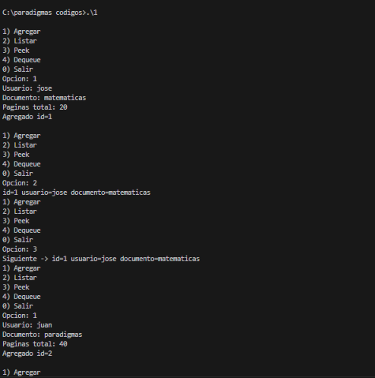

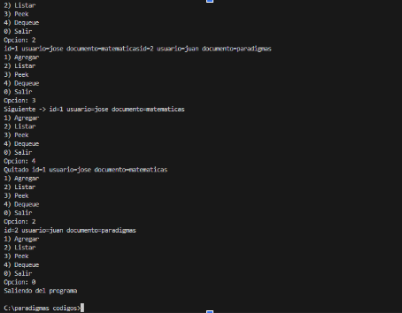

2.Memoria dinámica
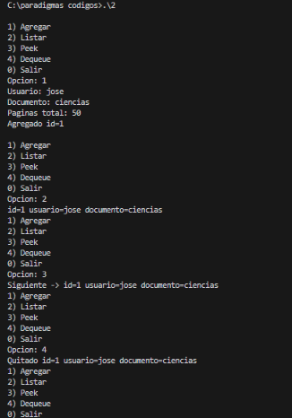
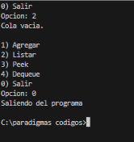

1. ¿Dónde guardaste el contador de id y por qué?
Se guardó en la variable next_id  en el main porque es un valor que está ahí durante toda la ejecución del programa.

2. En tu versión dinámica: ¿qué función es responsable de liberar memoria? ¿cómo lo verificas?
qd_destroy es la que se encarga de liberar la memoria y se verifica recorriendo todos los nodos con un while hasta que la cabeza apunte a null.

3. ¿Qué invariantes mantiene tu cola? (por ejemplo: rangos y significado de front/rear/size)

cabeza  siempre apunta al primero, cola siempre apunta al último,size==0 entonces cabeza y cola son ==0,size>=0.

4.¿Por qué peek no debe modificar la cola?
No debe modificarla porque de lo único que se debe de encargar, es de consultar al frente sin alterar el orden FIFO.

5. Si el programa falla al agregar trabajos, ¿cómo distingues entre “cola llena” y “entrada in-
válida”?
Si malloc regresa null, es fallo en la memoria. Si el usuario ingresa un nombre vacío o páginas<=0 es entrada válida, y se valida antes de llamar a qd_enqueue.

1.Esta variable es local.
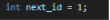

2.Aqui se reserva y se valida
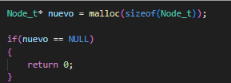

Aqui se libera memoria
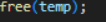

3.Aqui se modifica la cola
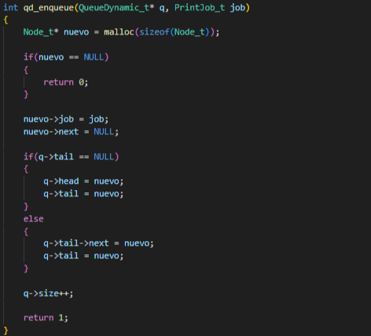

Aquí solo se consulta
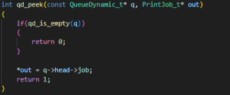

Cola vacia
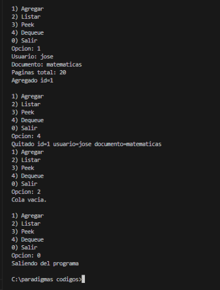

Cola llena
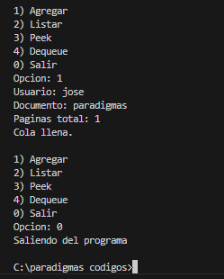

Introducción
En esta práctica se resolvió el problema de gestionar trabajos de impresión .Cuando varios varios usuarios envían documentos, deben atenderlos en orden de llegada. Para estos utilizamos la cola FIFO ya que nos asegura que el primer trabajo en entrar será el primer atendido. Hicimos una versión con memoria estática y una versión con memoria dinámica.

PrintJob_t=Representa un trabajo de impresion con los campos=
1.id:Identificador.
2.usuario:Nombre de quien envio el trabajo.
3.Documento:Nombre del archivo que se va a imprimir.
4.Paginas total:Cantidad de paginas que tiene el documento.

Cola estatica:Usa un arreglo fijo con una capacidad maxima y size indica cuanto hay actualmente.
Cola dinamica: Se usa lista enlazada donde cada nodo contiene un trabajo y un puntero al siguente nodo.La estructura QueueDynamic_T tiene 2 punteros, el head que apunta al primer trabajo y la cola que apunta al ultimo trabajo.Cuando quitamos un nodo , se agarra el  nodo head y head avanza al siguiente y se librera la memoria del nodo utilizando free().

Es local en el main y existe mientras se corre el programa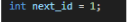

Es local en el main y existe mientras se corre el programa.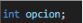

Puntero local dentro de qd_destroy, se usa para recorre la lista, solo funciona dentro de esa función.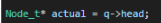

Stack: variables como opcion, next_id, job en main se alojan automáticamente y se liberan al terminar la función.
Heap: cada nodo se aloja con malloc en qd_enqueue, existe hasta que se llama free explícitamente.

Se libera en qd_dequeue libera el nodo sacado, qd_destroy libera todos los restantes al salir.

Recibe un puntero porque necesita modificar la cola.

Usa const porque solo consulta el campo size para verificar si la cola está vacía, sin modificar nada.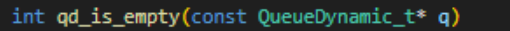

Recibe un puntero porque necesita modificar la cola agregando un nodo.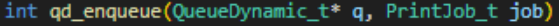

Usa const porque solo consulta sin modificar.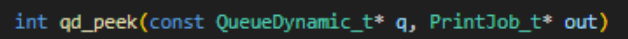

Recibe un puntero porque necesita modificar la cola.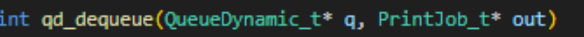

Usa const porque solo recorre y muestra los trabajos de la cola sin modificar ningún nodo.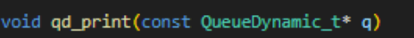

Recibe un puntero porque modifica la cola liberando nodos.

Agrupa todos los datos de un trabajo de impresión en una sola unidad. Se usó struct porque necesitamos manejar distintos tipos de datos juntos (int, char[], enum) que pertenecen a un mismo concepto.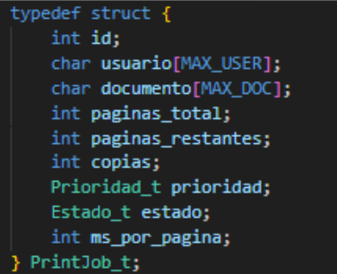

Representa un nodo de la lista enlazada. Contiene un PrintJob_t con los datos del trabajo y un puntero next que apunta al siguiente nodo. 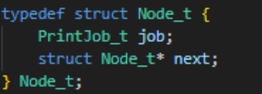

Representa la cola completa. Contiene dos punteros: head que apunta al primer nodo y tail que apunta al último nodo, más un contador size con la cantidad actual de trabajos.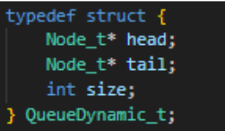

Es enum porque representa las etapas por las que pasa una impresión.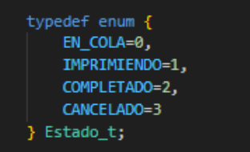

Cola estática: Se implementó con un arreglo fijo de tamaño MAX_JOBS=10. Su ventaja principal es la simplicidad, no requiere manejo de memoria y no puede haber fugas de memoria. Sin embargo tiene limitaciones: si se necesitan más de 10 trabajos simultáneos la cola rechaza nuevos ingresos y dice”Cola llena”, y el dequeue requiere desplazar todos los elementos una posición, lo que tiene un costo de O(n).

Cola dinámica: Se implementó con una lista enlazada usando nodos Node_t creados con malloc. Su ventaja es que no tiene límite fijo de capacidad, crece según sea necesario. El enqueue es O(1) gracias al puntero cola. Sin embargo requiere manejo explícito de memoria, si se olvida llamar qd_destroy al salir ocurre una fuga de memoria, y cada nodo ocupa memoria extra por el puntero next.

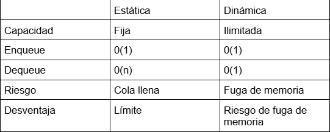

Conclusiones
A lo largo de esta práctica, implementamos un sistema de cola de impresión en dos versiones distintas, una de memoria estática y otra de memoria dinámica.Aprendí que una cola FIFO es la estructura adecuada y correcta para este tipo de problemas ya que garantiza que los trabajos se atiendan en el orden en que llegaron.Tambien aprendi que es muy importante liberar la memoria al final del programa cuando trabajamos con memoria dinámica porque si no lo hacemos , podemos ocasionar una fuga de memoria.

