+++
date = '2026-02-14T23:50:16-06:00'
draft = false
title = 'Practica2: El paradigma orientado a objetos'
+++

1. Introducción

Problema

desarrollo de un Simulador de Estacionamiento (Parking Lot) implementado con el paradigma de Programación Orientada a Objetos (POO) en Python 3.10+. El sistema administra un estacionamiento con lugares (spots), vehículos y tickets, permitiendo registrar entradas y salidas, calcular cobros y mostrar el estado de ocupación.

El sistema debe hacer cumplir las siguientes reglas de negocio:
Un lugar solo puede estar ocupado por un vehículo a la vez.
Un ticket activo representa un vehículo dentro del estacionamiento.
La entrada asigna un lugar compatible y crea un ticket activo.
La salida cierra el ticket, libera el lugar y calcula el costo.
Si no hay lugares disponibles compatibles, se rechaza la entrada.

Objetivos
El objetivo general es diseñar e implementar un sistema que haga evidentes los conceptos de POO: modelo, encapsulación, abstracción, herencia, composición, comportamiento, polimorfismo y subtipos, culminando con una interfaz web con Flask bajo un patrón MVC simple.

Objetivos específicos:
Identificar entidades del dominio y modelarlas como clases con atributos y métodos.
Aplicar encapsulación mediante atributos privados y validaciones en métodos.
Utilizar abstracción para separar la política de cobro (RatePolicy) del resto del sistema.
Implementar composición: ParkingLot tiene ParkingSpot y Ticket.
Emplear herencia y subtipos: Car y Motorcycle extienden Vehicle.
Aplicar polimorfismo con una interfaz común de cobro intercambiable.
Integrar el modelo en una interfaz web (Flask) bajo MVC simple.

Modelo del Dominio

Diagrama UML en plant UML


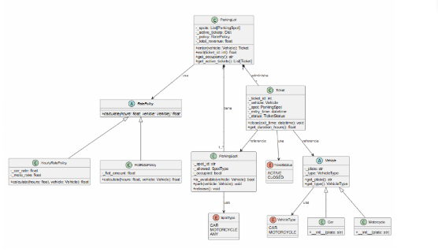


Lista de Clases y Responsabilidades

El sistema está compuesto por las siguientes clases principales:


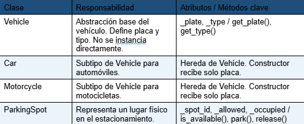


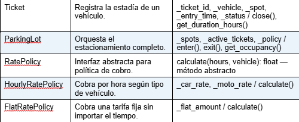


Evidencia de Conceptos POO

Encapsulación

La encapsulación garantiza que los atributos internos no se modifiquen directamente desde fuera de la clase. Todos los atributos del sistema son privados (prefijo _) y solo se acceden mediante propiedades o métodos. Las validaciones viven dentro de los métodos, y el sistema nunca puede quedar con dos vehículos en el mismo spot.

Ejemplo — validación en ParkingSpot.park():
```c
def park(self, vehicle: Vehicle) -> None:
    if self._occupied:
        raise ValueError(f'El spot {self._spot_id} ya está ocupado.')
    if not self.is_available(vehicle):
        raise ValueError(f'Tipo de vehículo incompatible.')
    self._current_vehicle = vehicle
    self._occupied = True
```

Abstracción

La lógica de cobro está separada del resto del sistema mediante la clase abstracta RatePolicy. Esta define el contrato calculate(hours, vehicle) → float que toda política debe implementar. ParkingLot no sabe cómo se calcula el costo; solo invoca el método de la política inyectada, lo que permite cambiar la tarifa sin modificar el modelo.

Snippet — definición de RatePolicy (ABC):
```c
from abc import ABC, abstractmethod

class RatePolicy(ABC):
    @abstractmethod
    def calculate(self, hours: float, vehicle: Vehicle) -> float:
        pass
```


Composición

ParkingLot administra una colección de ParkingSpot y un diccionario de Ticket activos. Ticket, a su vez, tiene una referencia a Vehicle y a ParkingSpot. La política de cobro (RatePolicy) se inyecta en ParkingLot al momento de la construcción, siguiendo el principio de inversión de dependencias.

Snippet — constructor de ParkingLot:
```c
class ParkingLot:
    def __init__(self, policy: Optional[RatePolicy] = None):
        self._spots: List[ParkingSpot] = self._create_default_spots()
        self._active_tickets: Dict[int, Ticket] = {}
        self._next_ticket_id: int = 1
        self._total_revenue: float = 0.0
        self._policy: RatePolicy = policy or HourlyRatePolicy()
```


Herencia y Subtipos

Car y Motorcycle son subtipos de Vehicle. Heredan su comportamiento base (validación de placa, acceso a tipo) y el constructor simplifica la creación al recibir solo la placa, delegando el tipo al padre.

Snippet — jerarquía de herencia:
```c
class Vehicle:
    def __init__(self, plate: str, vehicle_type: VehicleType):
        if not plate or not plate.strip():
            raise ValueError('La placa no puede estar vacía.')
        self._plate = plate.strip().upper()
        self._type = vehicle_type

class Car(Vehicle):
    def __init__(self, plate: str):
        super().__init__(plate, VehicleType.CAR)

class Motorcycle(Vehicle):
    def __init__(self, plate: str):
        super().__init__(plate, VehicleType.MOTORCYCLE)
```

Polimorfismo

HourlyRatePolicy y FlatRatePolicy implementan la misma interfaz RatePolicy. ParkingLot usa la interfaz común calculate(hours, vehicle), por lo que el comportamiento cambia según la política inyectada sin modificar el código del controlador. Esto permite agregar nuevas políticas sin tocar ParkingLot ni app.py.

Snippet — polimorfismo en acción:

# HourlyRatePolicy: $10/h para Car, $5/h para Motorcycle
```c
hourly = HourlyRatePolicy()
print(hourly.calculate(2, Car('ABC-123')))   # -> 20.0
print(hourly.calculate(2, Motorcycle('M-01'))) # -> 10.0
```

# FlatRatePolicy: siempre $20 sin importar tiempo o tipo
```c
flat = FlatRatePolicy(20.0)
print(flat.calculate(5, Car('ABC-123')))     # -> 20.0
```


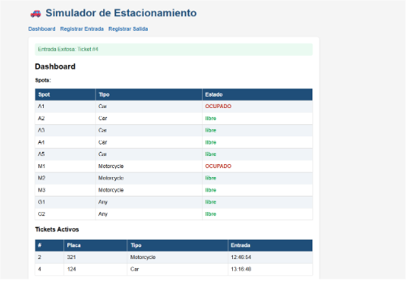


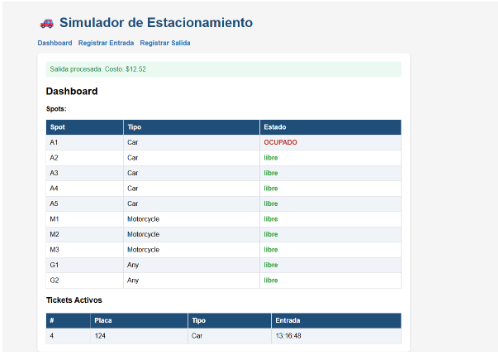


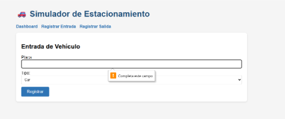


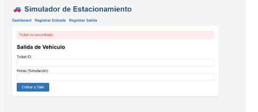


MVC con Flask

Separación de responsabilidades

La arquitectura del sistema sigue el patrón Modelo-Vista-Controlador (MVC):

Model (models/): contiene todas las clases del dominio — Vehicle, Car, Motorcycle, ParkingSpot, Ticket, ParkingLot, RatePolicy y sus implementaciones. Esta capa no conoce Flask ni HTTP.
View (templates/): plantillas HTML (Jinja2) que reciben datos del controlador y los presentan al usuario. No contienen lógica de negocio.
Controller (app.py): rutas Flask que reciben peticiones HTTP, invocan métodos del modelo y retornan la vista apropiada usando render_template o redirect.

Esta separación cumple el requisito del profesor: las rutas Flask usan el mismo modelo ya desarrollado sin reescribir lógica de negocio.

Rutas implementadas


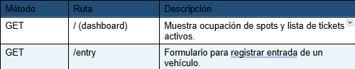


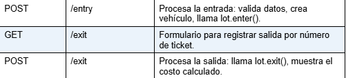


Pantallas


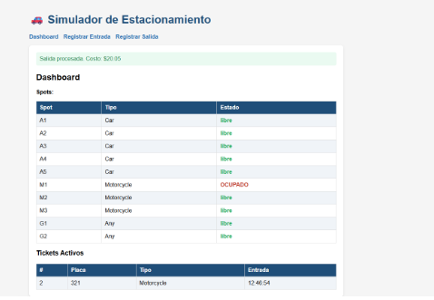


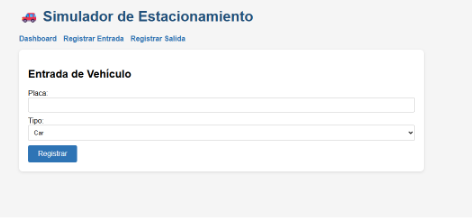


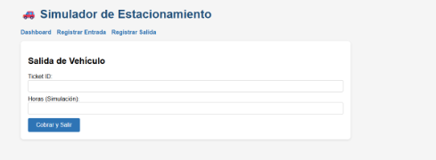


Pruebas Manuales

Se realizaron al menos dos flujos completos para verificar el funcionamiento del sistema.

Flujo 1 — Entrada y salida de automóvil (HourlyRatePolicy)
1. Se ejecuta cli.py y se selecciona la opción 1 (Registrar entrada).
2. Se ingresan placa=123 y tipo=Car.
3. El sistema asigna el spot A1 y crea el Ticket #1.
4. Se selecciona la opción 2 (Registrar salida), se ingresa ticket_id=1 y horas=2.
5. libera el spot A1 y muestra el precio.


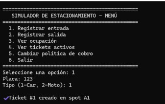


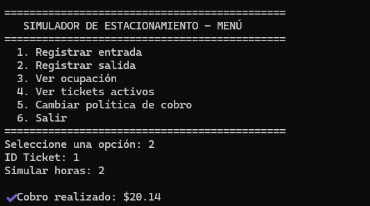


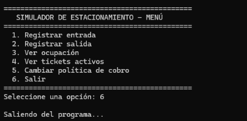


Flujo 2 — Entrada y salida de motocicleta (polimorfismo: FlatRatePolicy)

1. Se registra entrada: placa=123, tipo=Motorcycle. Se asigna spot M1, Ticket #1.
2. Se selecciona la opción 5 (Cambiar política) y se elige FlatRatePolicy ($20 fijo).
3. Se registra salida con horas=5.
4. El sistema calcula: tarifa fija = $20.00 (sin importar las 5 horas).


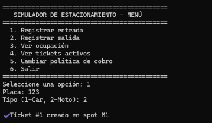


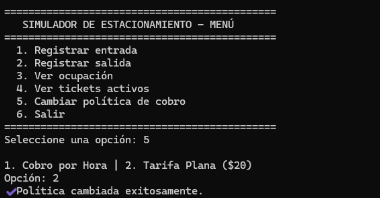


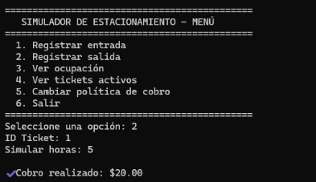


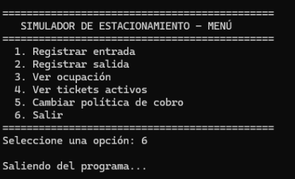


Sesión 1

Evidencia: captura/log demostrando entrada, salida y consulta de ocupación.

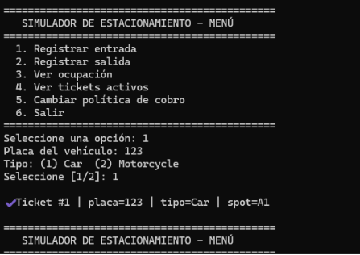


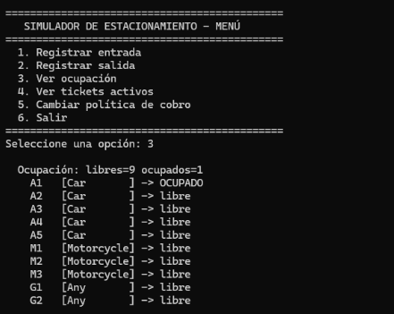


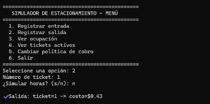


Sesion 2

Evidencia: log/captura mostrando un caso donde el polimorfismo cambia el resultado (cobro distinto).


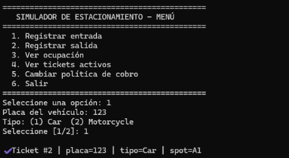


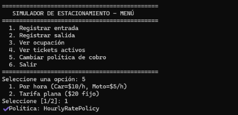


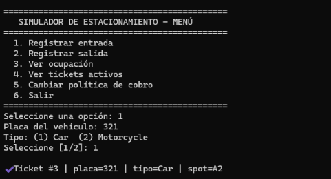


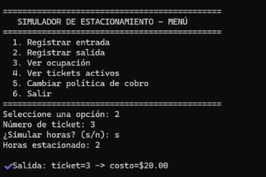


Sesión 3
Evidencia: capturas de las pantallas y un flujo completo (entrada -> dashboard -> salida).


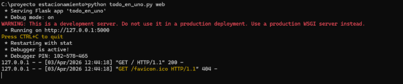


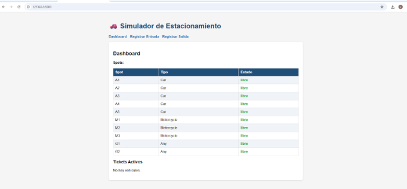


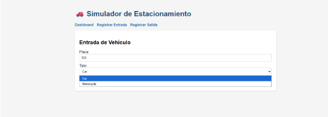


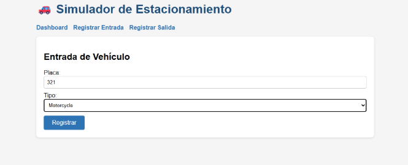


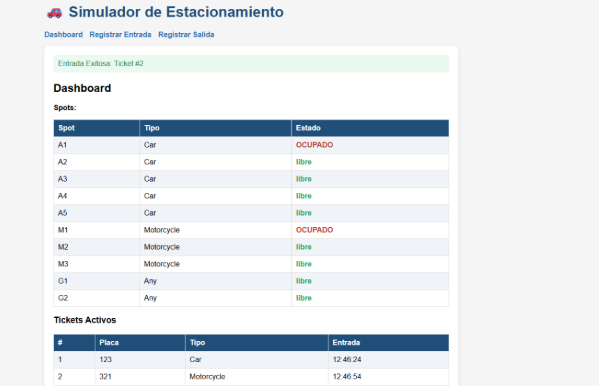


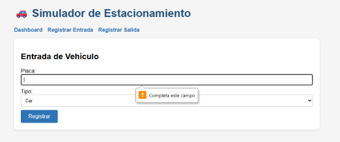


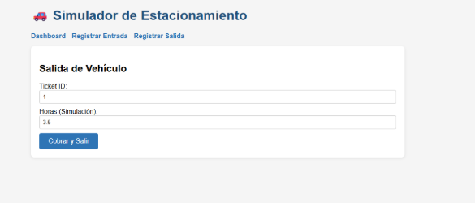


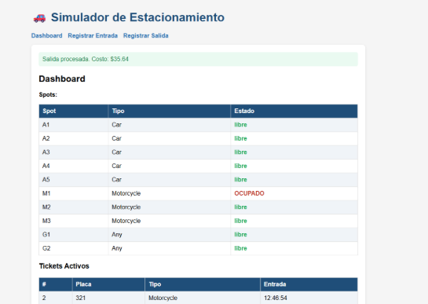


Conclusiones

El desarrollo del Simulador de Estacionamiento permitió aplicar de manera práctica los principios fundamentales de la Programación Orientada a Objetos. La encapsulación garantizó que el estado interno del sistema solo se modifique a través de métodos validados, evitando inconsistencias como dos vehículos en el mismo spot.

Conectar el modelo con Flask me mostró que un buen diseño de clases es independiente de la interfaz, el mismo código funcionó tanto en consola como en web sin modificarlo.


Preguntas guia
¿Qué clase concentra la responsabilidad de asignar spots y por qué? 
ParkingLot concentra la responsabilidad de asignar spots porque es la única clase que tiene visión global de todos los spots disponibles y puede decidir cuál es compatible con el vehículo que quiere entrar.


¿Qué invariantes protege tu modelo? (menciona al menos 2)
El modelo protege dos invariantes principales. La primera es que un spot no puede tener dos vehículos al mismo tiempo, ya que el método park() lanza un error si el spot ya está ocupado. La segunda es que un ticket cerrado no puede cerrarse de nuevo, porque close() verifica que el estado sea ACTIVE antes de proceder.


¿Dónde se aplica polimorfismo y qué ventaja aporta en tu diseño? 
El polimorfismo se aplica en RatePolicy. Tanto HourlyRatePolicy como FlatRatePolicy implementan el mismo método calculate() pero con lógica distinta. La ventaja es que ParkingLot no necesita saber cuál política está usando, lo que permite cambiar o agregar nuevas formas de cobro sin modificar ninguna otra clase.


¿Qué parte del sistema pertenece a Model, View y Controller en tu Flask?
En Flask el Model son todas las clases del dominio en models/, el View son los templates HTML que solo muestran datos, y el Controller es app.py con las rutas que reciben las peticiones y llaman al modelo.


Si mañana cambian las tarifas, ¿qué clase(es) tocarías y por qué? 
Si cambian las tarifas solo tocaría HourlyRatePolicy o FlatRatePolicy dependiendo del caso. Si la nueva lógica es completamente distinta, simplemente creo una clase nueva que herede de RatePolicy y la inyecto en ParkingLot sin modificar nada más.


codigo .py
```c
import sys
from datetime import datetime, timedelta
from flask import Flask, render_template_string, request, redirect, url_for, flash

# ══════════════════════════════════════════════════════════════════════════════
# 1. MODELOS DE DATOS (POO: HERENCIA Y POLIMORFISMO)
# ══════════════════════════════════════════════════════════════════════════════

class Vehicle:
    def __init__(self, plate):
        if not plate: raise ValueError("La placa es obligatoria.")
        self._plate = plate
    def get_plate(self): return self._plate

class Car(Vehicle):
    def __str__(self): return f"Auto [{self.get_plate()}]"

class Motorcycle(Vehicle):
    def __str__(self): return f"Moto [{self.get_plate()}]"

class RatePolicy:
    def calculate(self, entry_time, exit_time, vehicle): pass

class HourlyRatePolicy(RatePolicy):
    def calculate(self, entry_time, exit_time, vehicle):
        duration = (exit_time - entry_time).total_seconds() / 3600
        rate = 10 if isinstance(vehicle, Car) else 5
        return round(max(1, duration) * rate, 2)

class FlatRatePolicy(RatePolicy):
    def calculate(self, entry_time, exit_time, vehicle):
        return 20.0 

class ParkingTicket:
    def __init__(self, ticket_id, vehicle, spot):
        self.ticket_id = ticket_id
        self.vehicle = vehicle
        self.spot = spot
        self.entry_time = datetime.now()

class SpotType:
    CAR = "Car"
    MOTO = "Motorcycle"
    ANY = "Any"

class ParkingSpot:
    def __init__(self, spot_id, allowed_type):
        self.spot_id = spot_id
        self.allowed = allowed_type
        self.occupied = False
        self.vehicle = None
    def assign(self, vehicle):
        self.occupied = True
        self.vehicle = vehicle
    def release(self):
        self.occupied = False
        self.vehicle = None

class ParkingLot:
    def __init__(self):
        self._spots = [ParkingSpot(f"A{i}", SpotType.CAR) for i in range(1, 6)] + \
                      [ParkingSpot(f"M{i}", SpotType.MOTO) for i in range(1, 4)] + \
                      [ParkingSpot(f"G{i}", SpotType.ANY) for i in range(1, 3)]
        self._tickets = {}
        self._next_id = 1
        self._policy = HourlyRatePolicy()

    def enter(self, vehicle):
        target = SpotType.CAR if isinstance(vehicle, Car) else SpotType.MOTO
        spot = next((s for s in self._spots if not s.occupied and (s.allowed == target or s.allowed == SpotType.ANY)), None)
        if not spot: raise Exception("No hay lugar disponible.")
        t = ParkingTicket(self._next_id, vehicle, spot)
        spot.assign(vehicle)
        self._tickets[self._next_id] = t
        self._next_id += 1
        return t

    def exit(self, tid, manual_now=None):
        t = self._tickets.pop(tid, None)
        if not t: raise Exception("Ticket no encontrado.")
        cost = self._policy.calculate(t.entry_time, manual_now or datetime.now(), t.vehicle)
        t.spot.release()
        return cost

    def get_spots(self): return self._spots
    def get_active_tickets(self): return list(self._tickets.values())

# ══════════════════════════════════════════════════════════════════════════════
# 2. INTERFAZ WEB (FLASK)
# ══════════════════════════════════════════════════════════════════════════════

TEMPLATES = {
    'base.html': '''
        <!DOCTYPE html>
        <html>
        <head>
            <title>{{ title }}</title>
            <style>
                body { font-family: sans-serif; background: #f4f7f6; padding: 20px; }
                .container { max-width: 850px; margin: auto; background: white; padding: 20px; border-radius: 8px; box-shadow: 0 2px 10px rgba(0,0,0,0.1); }
                h1 { color: #1F4E79; text-align: center; }
                nav { text-align: center; margin-bottom: 20px; padding-bottom: 10px; border-bottom: 1px solid #eee; }
                nav a { margin: 0 12px; text-decoration: none; color: #2E74B5; font-weight: bold; }
                .box { border: 1px solid #ddd; padding: 15px; border-radius: 5px; }
                table { width: 100%; border-collapse: collapse; margin-top: 10px; }
                th, td { border: 1px solid #ddd; padding: 10px; text-align: left; }
                th { background: #1F4E79; color: white; }
                .btn { background: #2E74B5; color: white; padding: 10px; border: none; width: 100%; cursor: pointer; border-radius: 4px; font-weight: bold; }
                .alert { padding: 12px; margin-bottom: 15px; border-radius: 4px; background: #d4edda; color: #155724; border: 1px solid #c3e6cb; }
            </style>
        </head>
        <body>
            <div class="container">
                <h1>🏎 Simulador de Estacionamiento</h1>
                <nav>
                    <a href="/">Dashboard</a>
                    <a href="/entry">Registrar Entrada</a>
                    <a href="/exit">Registrar Salida</a>
                    <a href="/policy">Configuración</a>
                </nav>
                <div class="alert">{{m}}</div>
                
            </div>
        </body>
        </html>
    ''',
    'dashboard.html': '''
        
        
        <div class="box">
            <h3>Estado de los Spots</h3>
            <table>
                <tr><th>ID</th><th>Tipo Permitido</th><th>Estado</th></tr>
                
                <tr><td>{{s.spot_id}}</td><td>{{s.allowed}}</td><td style="color:{{'#dc3545' if s.occupied else '#28a745'}}; font-weight:bold;">{{'OCUPADO' if s.occupied else 'libre'}}</td></tr>
                
            </table>
            <br>
            <h3>Tickets Activos</h3>
            
            <table>
                <tr><th>#</th><th>Placa</th><th>Entrada</th></tr>
                
                <tr><td>{{t.ticket_id}}</td><td>{{t.vehicle.get_plate()}}</td><td>{{t.entry_time.strftime('%H:%M:%S')}}</td></tr>
                
            </table>
            <p>No hay vehículos registrados.</p>
        </div>
        
    ''',
    'entry.html': '''
        
        
        <div class="box">
            <h3>Entrada de Vehículo</h3>
            <form method="POST">
                <label>Placa:</label><br>
                <input type="text" name="plate" required style="width:97%; padding:8px; margin:10px 0;"><br>
                <label>Tipo:</label><br>
                <select name="type" style="width:100%; padding:8px; margin-bottom:20px;">
                    <option value="car">Carro</option>
                    <option value="moto">Motocicleta</option>
                </select>
                <button class="btn">Registrar Entrada</button>
            </form>
        </div>
        
    ''',
    'exit.html': '''
        
        
        <div class="box">
            <h3>Salida de Vehículo</h3>
            <form method="POST">
                <label>ID de Ticket:</label><br>
                <input type="number" name="tid" required style="width:97%; padding:8px; margin:10px 0;"><br>
                <label>Horas de Simulación (Opcional):</label><br>
                <input type="number" step="0.1" name="hours" placeholder="0 para tiempo real" style="width:97%; padding:8px; margin-bottom:20px;"><br>
                <button class="btn">Procesar Pago y Salida</button>
            </form>
        </div>
        
    ''',
    'policy.html': '''
        
        
        <div class="box">
            <h3>Configuración de Cobro</h3>
            <form method="POST">
                <p>Elija el método de cobro polimórfico:</p>
                <select name="policy" style="width:100%; padding:10px; margin-bottom:20px;">
                    <option value="hourly">Tarifa por Hora (C:$10 / M:$5)</option>
                    <option value="flat">Tarifa Plana ($20 Fijo)</option>
                </select>
                <button class="btn">Actualizar Sistema</button>
            </form>
        </div>
        
    '''
}

def setup_flask(lot):
    app = Flask(__name__)
    app.secret_key = "universidad"

    @app.route('/')
    def dashboard():
        return render_template_string(TEMPLATES['dashboard.html'], title="Dashboard", 
                                     spots=lot.get_spots(), tickets=lot.get_active_tickets())

    @app.route('/entry', methods=['GET', 'POST'])
    def entry():
        if request.method == 'POST':
            try:
                v = Car(request.form['plate']) if request.form['type'] == 'car' else Motorcycle(request.form['plate'])
                t = lot.enter(v)
                flash(f"Registro exitoso. Ticket #{t.ticket_id}")
                return redirect('/')
            except Exception as e: flash(str(e))
        return render_template_string(TEMPLATES['entry.html'], title="Entrada")

    @app.route('/exit', methods=['GET', 'POST'])
    def exit():
        if request.method == 'POST':
            try:
                h = float(request.form.get('hours') or 0)
                cost = lot.exit(int(request.form['tid']), datetime.now() + timedelta(hours=h) if h > 0 else None)
                flash(f"Salida confirmada. Total: ${cost:.2f}")
                return redirect('/')
            except Exception as e: flash(str(e))
        return render_template_string(TEMPLATES['exit.html'], title="Salida")

    @app.route('/policy', methods=['GET', 'POST'])
    def policy():
        if request.method == 'POST':
            lot._policy = FlatRatePolicy() if request.form['policy'] == 'flat' else HourlyRatePolicy()
            flash("Sistema actualizado con la nueva política.")
            return redirect('/')
        return render_template_string(TEMPLATES['policy.html'], title="Configuración")

    return app

# ══════════════════════════════════════════════════════════════════════════════
# 3. INTERFAZ DE CONSOLA (CLI - 6 OPCIONES EXACTAS)
# ══════════════════════════════════════════════════════════════════════════════

def cli_menu(lot):
    while True:
        print("\n" + "="*45)
        print("   SIMULADOR DE ESTACIONAMIENTO - MENÚ")
        print("="*45)
        print("  1. Registrar entrada")
        print("  2. Registrar salida")
        print("  3. Ver ocupación")
        print("  4. Ver tickets activos")
        print("  5. Cambiar política de cobro")
        print("  6. Salir")
        print("="*45)
        
        opt = input("Seleccione una opción: ").strip()
        
        if opt == "1":
            p = input("Placa: ").upper()
            t = input("Tipo (1-Car, 2-Moto): ")
            try:
                v = Car(p) if t == "1" else Motorcycle(p)
                tk = lot.enter(v)
                print(f"\n✔ Ticket #{tk.ticket_id} creado en spot {tk.spot.spot_id}")
            except Exception as e: print(f"\n✘ Error: {e}")
        elif opt == "2":
            try:
                tid = int(input("ID Ticket: "))
                h = float(input("Simular horas: ") or 0)
                cost = lot.exit(tid, datetime.now() + timedelta(hours=h) if h > 0 else None)
                print(f"\n✔ Cobro realizado: ${cost:.2f}")
            except Exception as e: print(f"\n✘ Error: {e}")
        elif opt == "3":
            print("\nEstado de Cajones:")
            for s in lot.get_spots():
                st = "OCUPADO" if s.occupied else "libre"
                print(f"  {s.spot_id:3} | {s.allowed:10} | {st}")
        elif opt == "4":
            tks = lot.get_active_tickets()
            print(f"\nTickets en curso ({len(tks)}):")
            for t in tks:
                print(f"  #{t.ticket_id} | {t.vehicle.get_plate()} | Entró: {t.entry_time.strftime('%H:%M')}")
        elif opt == "5":
            print("\n1. Cobro por Hora | 2. Tarifa Plana ($20)")
            p = input("Opción: ")
            lot._policy = FlatRatePolicy() if p == "2" else HourlyRatePolicy()
            print("✔ Política cambiada exitosamente.")
        elif opt == "6":
            print("\nSaliendo del programa...\n")
            break

# ══════════════════════════════════════════════════════════════════════════════
# 4. PUNTO DE ARRANQUE
# ══════════════════════════════════════════════════════════════════════════════

if __name__ == "__main__":
    parking = ParkingLot()
    if len(sys.argv) > 1 and sys.argv[1] == "web":
        setup_flask(parking).run(debug=True)
    else:
        cli_menu(parking)
```

Templates

1. Base HTML
```C
<!DOCTYPE html>
<html lang="es">
<head>
    <meta charset="UTF-8">
    <meta name="viewport" content="width=device-width, initial-scale=1.0">
    <title>Simulador de Estacionamiento</title>
    <style>
        body { font-family: Arial, sans-serif; max-width: 900px; margin: 0 auto; padding: 20px; background: #f5f5f5; }
        h1 { color: #2c3e50; }
        nav a { margin-right: 15px; text-decoration: none; color: #2980b9; font-weight: bold; }
        nav a:hover { text-decoration: underline; }
        .container { background: white; padding: 20px; border-radius: 8px; box-shadow: 0 2px 6px rgba(0,0,0,0.1); margin-top: 15px; }
        .flash-error { color: #c0392b; background: #fdecea; padding: 10px; border-radius: 5px; margin-bottom: 10px; }
        .flash-success { color: #1e8449; background: #eafaf1; padding: 10px; border-radius: 5px; margin-bottom: 10px; }
        table { width: 100%; border-collapse: collapse; }
        th, td { padding: 10px; border: 1px solid #ddd; text-align: left; }
        th { background: #2c3e50; color: white; }
        tr:nth-child(even) { background: #f9f9f9; }
        input, select { padding: 8px; width: 100%; box-sizing: border-box; margin-bottom: 10px; border: 1px solid #ccc; border-radius: 4px; }
        button { padding: 10px 20px; background: #2980b9; color: white; border: none; border-radius: 4px; cursor: pointer; font-size: 1em; }
        button:hover { background: #1a5276; }
        .badge-active { color: green; font-weight: bold; }
        .badge-free { color: #27ae60; }
        .badge-occupied { color: #c0392b; }
    </style>
</head>
<body>
    <h1>🚗 Simulador de Estacionamiento</h1>
    <nav>
        <a href="/">Dashboard</a>
        <a href="/entry">Registrar Entrada</a>
        <a href="/exit">Registrar Salida</a>
    </nav>
    <div class="container">
        
          
            <div class="flash-{{ category }}">{{ message }}</div>
          
        
        
    </div>
</body>
</html>
```

2. Dashboard HTML
```C



<h2>Dashboard</h2>

<h3>Ocupación</h3>
<p>
    <strong>Libres:</strong> {{ free }} &nbsp;|&nbsp;
    <strong>Ocupados:</strong> {{ occupied }}
</p>

<h3>Spots</h3>
<table>
    <tr><th>Spot</th><th>Tipo permitido</th><th>Estado</th></tr>
    
    <tr>
        <td>{{ spot.spot_id }}</td>
        <td>{{ spot.allowed.value }}</td>
        <td class="{{ 'badge-occupied' if spot.occupied else 'badge-free' }}">
            {{ 'OCUPADO' if spot.occupied else 'libre' }}
        </td>
    </tr>
    
</table>

<h3>Tickets Activos ({{ active_tickets|length }})</h3>

<table>
    <tr><th>#</th><th>Placa</th><th>Tipo</th><th>Spot</th><th>Entrada</th></tr>
    
    <tr>
        <td>{{ t.ticket_id }}</td>
        <td>{{ t.vehicle.get_plate() }}</td>
        <td>{{ t.vehicle.get_type().value }}</td>
        <td>{{ t.spot.spot_id }}</td>
        <td>{{ t.entry_time.strftime('%Y-%m-%d %H:%M:%S') }}</td>
    </tr>
    
</table>

    <p>No hay tickets activos.</p>


```

3. entry HTML
```C



<h2>Registrar Entrada</h2>
<div>
  <label>Placa:</label>
  <input type="text" name="plate" id="plate" placeholder="Ej: ABC-123" required>

  <label>Tipo de vehículo:</label>
  <select name="type" id="type">
    <option value="Car">Car</option>
    <option value="Motorcycle">Motorcycle</option>
  </select>

  <button onclick="submitEntry()">Registrar</button>
</div>

<script>
async function submitEntry() {
  const plate = document.getElementById('plate').value.trim();
  const type = document.getElementById('type').value;
  if (!plate) { alert('La placa es requerida.'); return; }
  const resp = await fetch('/entry', {
    method: 'POST',
    headers: {'Content-Type': 'application/x-www-form-urlencoded'},
    body: `plate=${encodeURIComponent(plate)}&type=${encodeURIComponent(type)}`
  });
  if (resp.redirected) { window.location.href = resp.url; }
  else { window.location.href = '/'; }
}
</script>

```

4. exit HTML
```C



<h2>Registrar Salida</h2>
<div>
  <label>Número de Ticket:</label>
  <input type="number" name="ticket_id" id="ticket_id" placeholder="Ej: 1" min="1" required>

  <label>Horas estacionado (simulado, opcional):</label>
  <input type="number" name="hours" id="hours" placeholder="Dejar vacío = tiempo real" min="0" step="0.5">

  <button onclick="submitExit()">Registrar Salida</button>
</div>

<script>
async function submitExit() {
  const ticket_id = document.getElementById('ticket_id').value.trim();
  const hours = document.getElementById('hours').value.trim();
  if (!ticket_id) { alert('El número de ticket es requerido.'); return; }
  let body = `ticket_id=${encodeURIComponent(ticket_id)}`;
  if (hours) body += `&hours=${encodeURIComponent(hours)}`;
  const resp = await fetch('/exit', {
    method: 'POST',
    headers: {'Content-Type': 'application/x-www-form-urlencoded'},
    body: body
  });
  if (resp.redirected) { window.location.href = resp.url; }
  else { window.location.href = '/'; }
}
</script>

```


Link a repositorio:https://github.com/Jose-Pablo-programacion/Portafolio_PP.git


Link a hugo:https://jose-pablo-programacion.github.io/Portafolio_PP/practica2/

