+++
date = '2026-02-14T23:50:36-06:00'
draft = false
title = 'Practica3: El paradigma funcional'
+++

Instalación de entorno
Para instalar el entorno de desarrollo de Haskell se utilizó GHCup, la herramienta oficial recomendada en la página de descargas de Haskell (haskell.org/downloads). 

Se abrio powershell y se ejecuto = Set-ExecutionPolicy Bypass -Scope Process -Force;[System.Net.ServicePointManager]::SecurityProtocol = [System.Net.ServicePointManager]::SecurityProtocol -bor 3072; try { & ([ScriptBlock]::Create((Invoke-WebRequest https://www.haskell.org/ghcup/sh/bootstrap-haskell.ps1 -UseBasicParsing))) -Interactive -DisableCurl } catch { Write-Error $_ } 

se realizaron las siguiente acciones:
1.Se le da enter

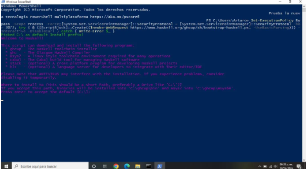

2.Se le da enter

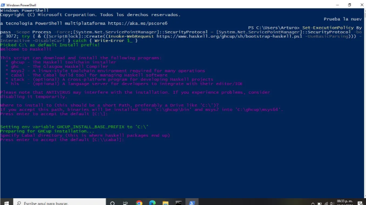

3.Se escribe Y y se le da enter

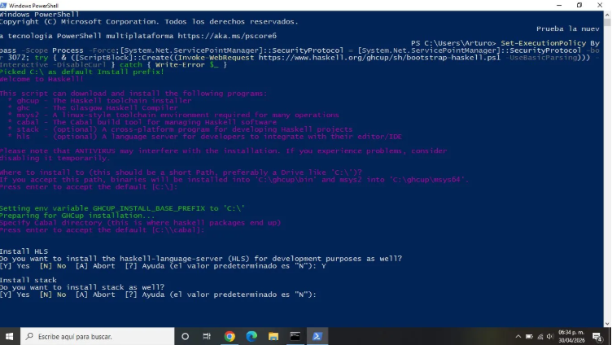

4.Se escribe Y y se le da enter

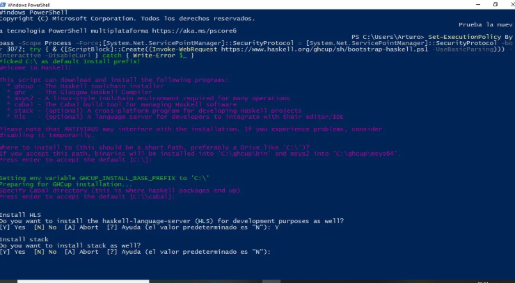

5.Se escribe Y y se le da enter

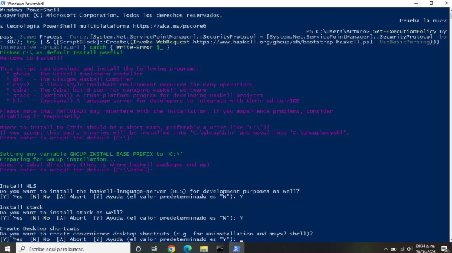

La instalacion se atoro a la mitad y se tuvo que cancelar usando ctrl + c pero se alcanzo a instalar GHcup y MSys2

En el segundo intento se continuo haciendo esto:
1.Se escribe C y se le da enter

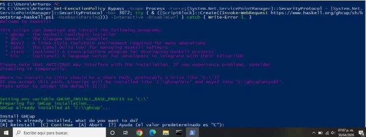

Se volvió a ejecutar el comando, el instalador detectó GHCup y MSys2 ya instalados y continuó desde donde se había quedado. Se escribio Y a las preguntas de instalar HLS, Stack y crear accesos directos en el escritorio y se le dio enter

2.Se continuo con la instalacion

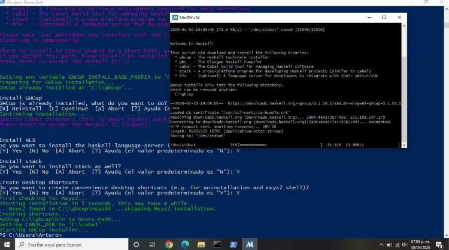

3.

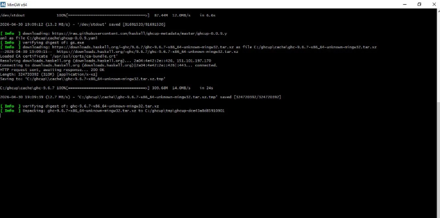

4.

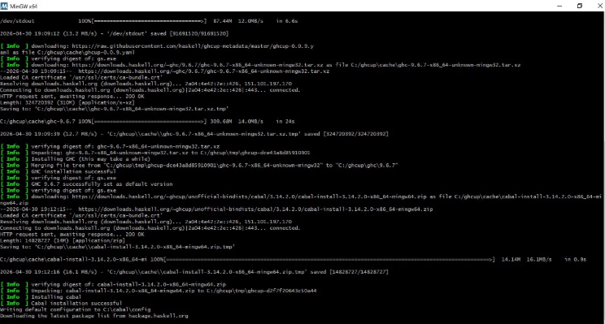

5.Se terminó de instalar todo correctamente.

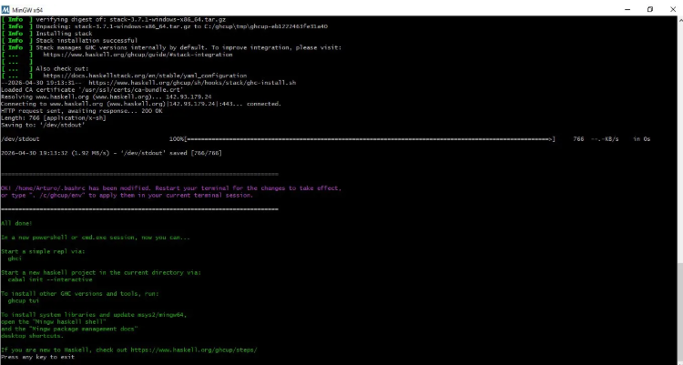

6.Se cierra esa pestaña y tambien la de powershell, se vuelve a abrir powershell y para confirmar que todo se instaló correctamente, se ejecutan los comandos de las versiones de ghc,stack y cabal.

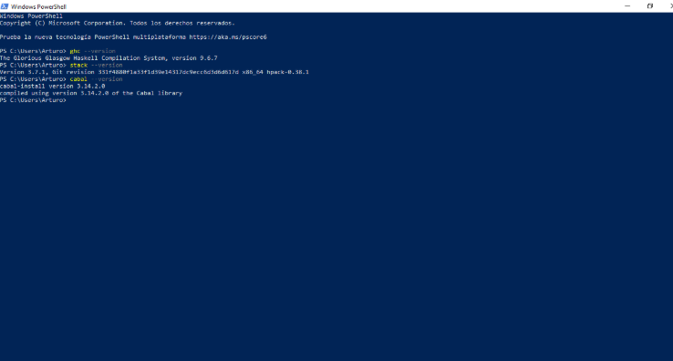

Para verificar que funcione bien el entorno, se ejecuta en powershell el comando ghci

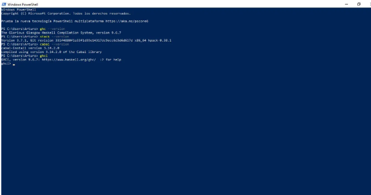

A continuación se ejecutan nuestras primeras lineas de código

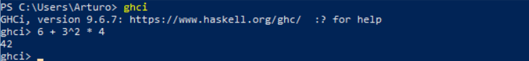

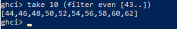

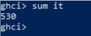

A continuación nos vamos a Vs code y creamos un archivo con extensión .hs y ejecutamos el siguiente código que nos otorga la guía oficial.

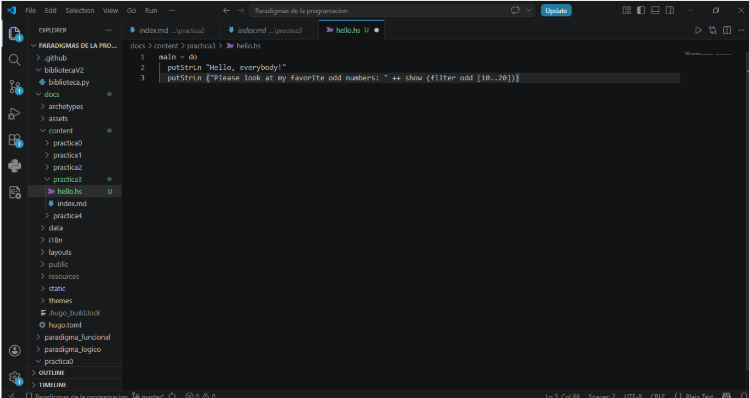

Ahora compilamos y ejecutamos el codigo en powershell

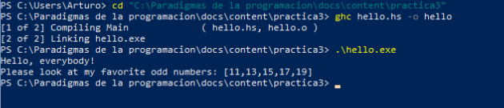

Ahora se instala la app TODO

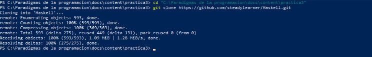

Ya nos aparece en vscode también

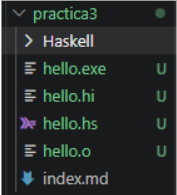

Ahora navegamos a la carpeta de la app TODO 

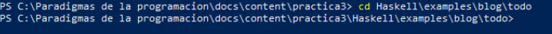

Ahora compilamos la app con stack, se ejecuta stack build

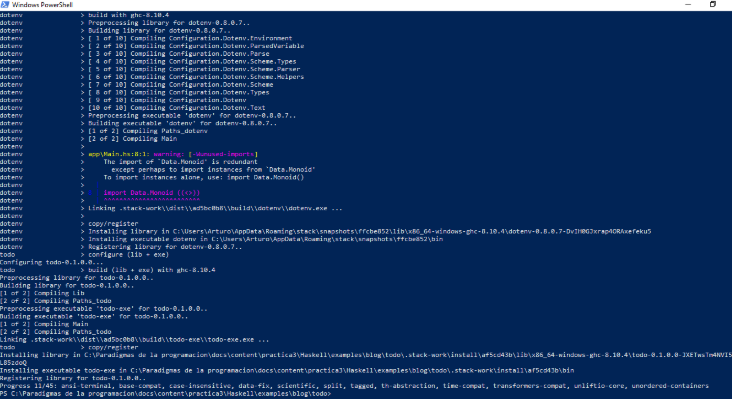

Ahora creamos un archivo.env para correr el stack y tambien creamos la variable WEBSITE en el archivo.env

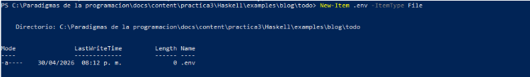

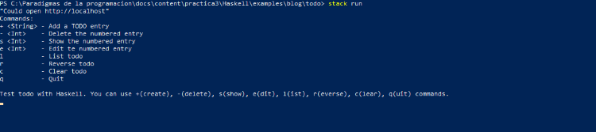

Como podemos ver la aplicación tiene diferentes comandos que son:
1.+ para agregar nuevas tareas
2.- para eliminar una tarea por su número
3.l para listar las tareas
4.s para mostrar el detalle de una tarea por su número
5.e para editar tareas
6.r para invertir el orden de la lista de tareas
7.c para borrar todas las tareas
8.q para salir de la aplicación

ahora escribimos por ejemplo +aprender Haskell

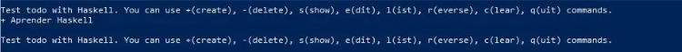

Ahora escribimos l para listar y ver que quedó guardada.

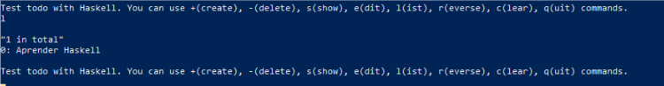

podemos poner otra mas

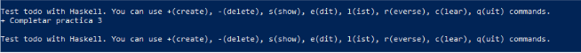

y luego escribir nuevamente l

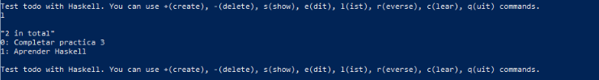

Conclusión= En esta práctica se instaló se configuró el entorno de Haskell usando GHcup, se usó stack y la herramienta de empaquetado Cabal.Se ejecuto un codigo básico en Haskell y finalmente se ejecuto la aplicacion TODO escrita en Haskell donde se nos permite gestionar tareas desde la terminal de comandos mediante comandos. 